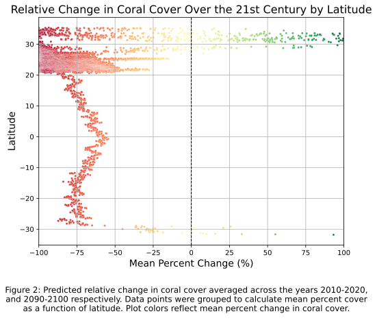

# MBIO 691L: VIZUALIZATION FINAL PROJECT
### Maluhia Stark-Kinimaka

# Coral Reef Data Visualization Project

## Overview
This project explores the predicted changes in coral cover over the 21st century, focusing on the impacts of environmental variables such as latitude, sea surface temperature (SST) and pH levels. The objective is to visually summarize the output of ecological-evolutionary simulations predicting coral cover changes globally. This is especially relevant given expectations of declining tropical coral cover due to rapidly warming ocean temperatures and ocean acidification.

The data utilized in this project is sourced from the given file `coral_model.csv`, which contains output from simulations covering approximately 52,000 sites. Each of the 12 different simulation configurations reflects varying future climate change predictions. For detailed reading, refer to the original publication [here](https://www.biorxiv.org/content/10.1101/2024.07.23.604846v1.full).

## Data Description
The `coral_model.csv` file includes the following data:

- **coral_cover_2020/2100**: Simulation estimates of tropical coral cover averaged across 2010-2020, and 2090-2100 respectively (km²).
- **SST_2020/SST_2100**: Mean SST (sea-surface temperature) averaged across 2010-2020, and 2090-2100 respectively (degrees C).
- **SST_seasonal**: Amplitude of the seasonal SST cycle, i.e., difference between summer and winter SST (degrees C).
- **pH_2020/pH_2100**: Mean pH averaged across 2010-2020, and 2090-2100 respectively.
- **PAR**: Benthic Photosynthetically Available Radiation (mol m⁻² d⁻¹).
- **longitude/latitude**: Longitude/latitude of the site.
- **model**: Simulation configuration, numbered 0-11.

## Project Goals
#### Part 1
This public GitHub repository has been created in fufillment of Part 1. 

#### Part 2
Visually summarize the output of these simulations in three figures of your choice. Selected visualizations are listed below:
- A map showing the predicted percentage change in coral cover over the 21st century, averaged across simulations.
- A plot illustrating the predicted percentage change in coral cover as a function of latitude.
- A 3D plot showing the predicted percentage change in coral cover as a function of SST and pH change.

## Figures

### Figure 1: Relative Change in Coral Cover Over the 21st Century

This figure presents the predicted relative change in coral cover across various locations, utilizing a Robinson projection for geographical representation.

### Figure 2: Relative Change in Coral Cover Over the 21st Century by Latitude

This scatter plot illustrates the mean percent change in coral cover as a function of latitude, highlighting geographic disparities in coral health.

### Figure 3: Relative Change in Mean Coral Cover over the 21st Century as a Function of SST and pH

This 3D scatter plot visualizes the relationship between predicted changes in coral cover, sea surface temperature changes, and pH levels.

## Requirements
To reproduce the figures and analyses in this script, please install the following Python libraries:
- NumPy
- Matplotlib (including `mpl_toolkits.mplot3d` for 3D plotting)
- Pandas
- Seaborn
- Cartopy

